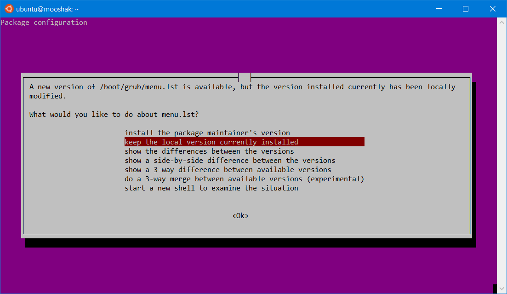
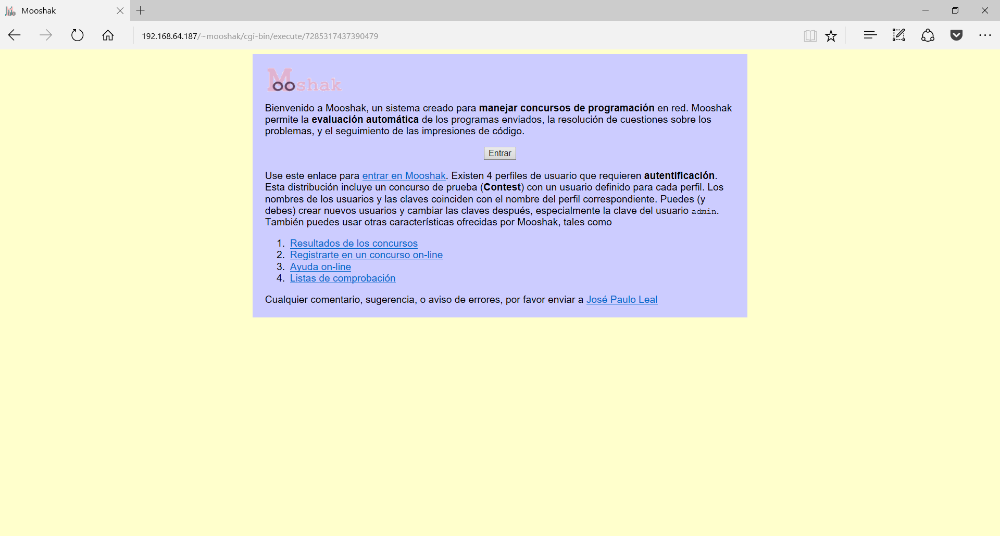

# Instalación

La instalación se va a realizar sobre un equipo Ubuntu 14.04.03 LTS. La guía original para este capítulo se puede encontrar en: http://blankrk.blogspot.com.es/2014/05/mooshak-installation-on-linux-1204-and.html

Bien comencemos!!

Suponiendo que se empieza con una instalación limpia, el primer paso es actualizar los repositorios y paquetes del equipo. Para ello usamos los siguientes comandos. Puede que en el proceso de actualización nos aparezca si deseamos modificar en grub: dejamos la opción por defecto.


<pre>
sudo apt-get update 
sudo apt-get upgrade
</pre>

El siguiente paso consiste en instalar el compilador de c y el programa make

<pre>
sudo apt-get install gcc
sudo apt-get install make
</pre>
A continuación instalamos Tcl, Apache y suexec.

<pre>
sudo apt-get install tcl xsltproc lpr rsync gcc libxml2-utils
sudo apt-get install apache2
sudo apt-get install apache2-suexec
</pre>
En caso de que no se encuentre el paquete apache2-suexec, se puede instalar el apache2-suexec-custom.

Una vez se ha instalado Apache, es encesario habilitar dos mods:
<pre>
sudo a2enmod userdir
    sudo a2enmod suexec
</pre>
Después habilitamos el userdir y el usexec modulos de Apache.

```
    cd /etc/apache2/mods-enabled
    sudo ln -s ../mods-available/userdir.conf
    sudo ln -s ../mods-available/userdir.load
    sudo ln -s ../mods-available/suexec.load
```    
    Es posible que haya salido el siguiente mensaje:

    <pre>
    ln: failed to create symbolic link './suexec.load': File exists
    </pre>
    
    No preocuparse por ello. El siguiente paso es configurar el soporte ce CGIs. Para ello hay que editar el archivo:/etc/apache2/mods-enabled/userdir.conf incluyendo el siguiente código dentro de la configuración del archivo userdir.conf.
    
    <pre>
    Options +ExecCGI -Includes -Indexes
        SetHandler cgi-script
        Order allow,deny
        Allow from all
        </pre>
        
        De tal forma que el archivo userdir.conf quedaría como sigue:
        
        <pre>
        UserDir public_html
        UserDir disabled root

        
                AllowOverride FileInfo AuthConfig Limit Indexes
                Options MultiViews Indexes SymLinksIfOwnerMatch IncludesNoExec
                
                        Require all granted
                
                
                        Require all denied
                
        
        
                Options +ExecCGI -Includes -Indexes
                SetHandler cgi-script
                Order allow,deny
                Allow from all
        


# vim: syntax=apache ts=4 sw=4 sts=4 sr noet
        </pre>
        
        En el archivo /etc/apache2/apache2.conf añadimos la línea 
        
        <pre>
        ServerName mooshak
        </pre>
        En mi caso, mi servidor se llama mooshak, indicale el nombre de tu servidor. Después de todos estos cambios, reiniciamos el servicios de apache. 
        
        <pre>
        sudo service apache2 restart
                </pre>
                
                Habilitamo los módulos CGI en Apache para configurar CGI en apache
                
                <pre>
                sudo a2enmod cgi
                </pre>
                Volvemos a reiniciar el servicio de apache
                <pre>
                sudo service apache2 restart
                </pre>
                Y ya solo nos queda instalar Mooshak. Ya tenemos toda la configuración hecha. Para descargarlos, nos dirigimos a su página principal: https://mooshak.dcc.fc.up.pt/

La última versión estable en el momento de este tutorial es la 1.6.2. Se puede descargar en nuestra máquina usando el comando wget

<pre>
wget https://mooshak.dcc.fc.up.pt/download/mooshak-1.6.2.tgz
</pre>

Una vez descargado, lo descomprimimos. 
<pre> tar xzf mooshak-1.6.2.tgz 
cd mooshak-1.6.2/ </pre>

Por último se instala:
<pre>
sudo ./install
</pre>

Puede que salga un mensaje similar a 

<pre>
Prerequisites Ok. Installing Mooshak on ubuntu, Apache 2.4
home dir created
data.tgz copied
source.tgz copied
Setting file permissions ... done
connecting to host mooshak. ... couldn't open socket: Name or service not known
connecting to host localhost ... connected!
could not find user name in the output of 'info'
</pre>

No nos preocupamos, reiniciamos el servidor apache

<pre>
sudo service apache2 restart
</pre>
y probamos en nuestro equipo. En mi caso es: http://192.168.64.187/~mooshak/ Aparecerá algo similar a: